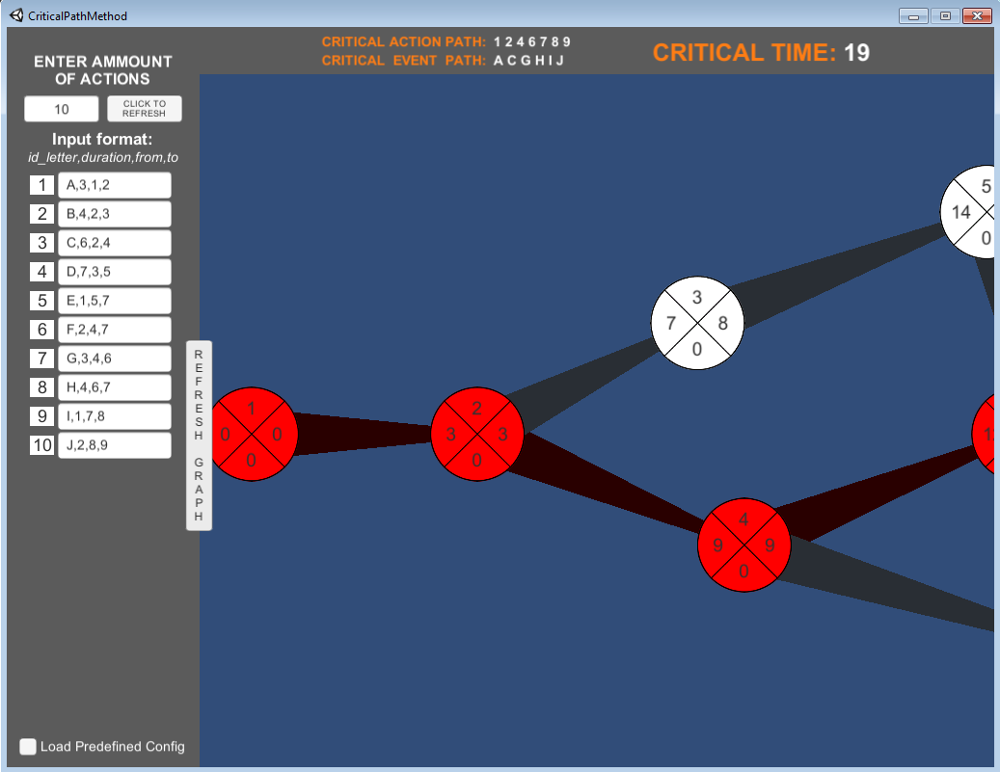

# Critical Path Method Algorithm
The critical path method (**CPM**) is an algorithm for scheduling a set of project activities.
## Features
 - Adding arbitrary ammount of input actions
 - Drawing *CPM graph* with Critical Path being colored
 - Calculating *Critical Action Path* and *Critical Event Path*
 - Calculating *Critical Time*
## Screenshots

## Built with
 - Unity Engine (C#)
